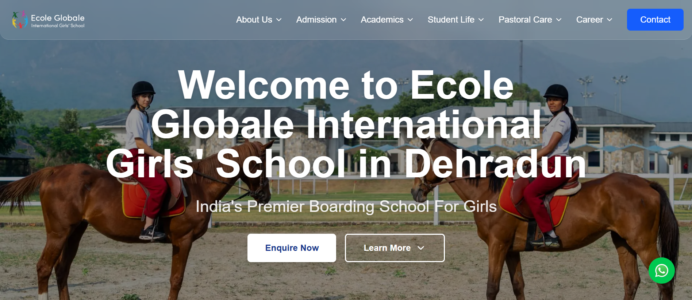
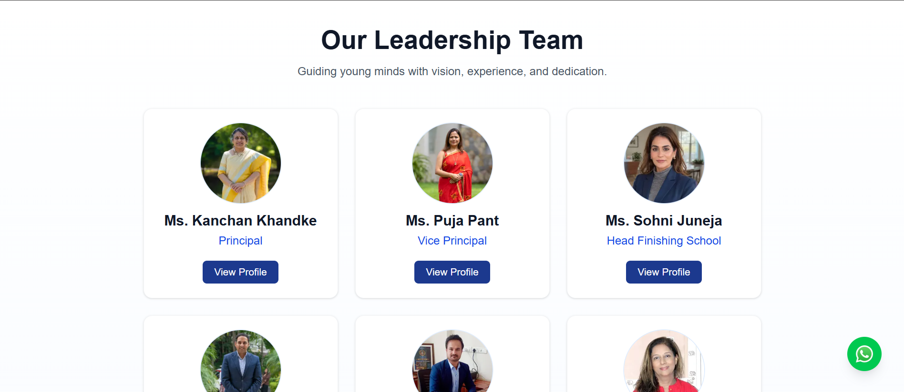
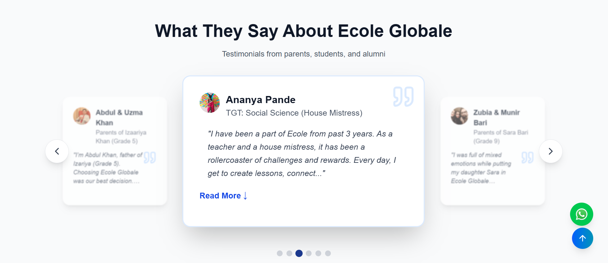
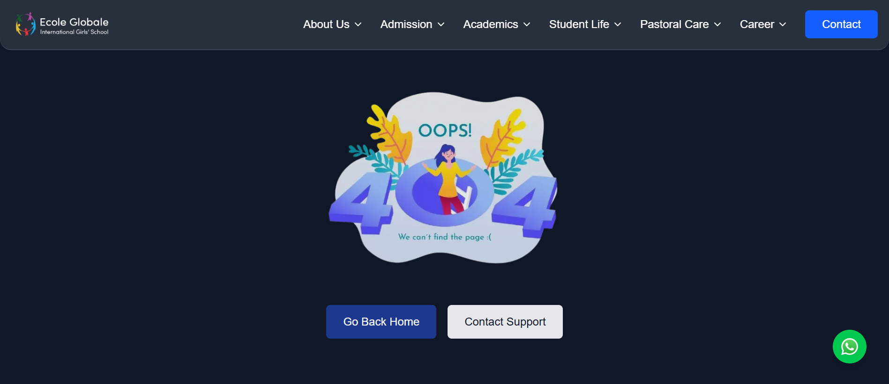

# 🌟Ecole Globale International Girls’ School — Website

A modern, SEO-optimized, and fully responsive website built with Next.js for Ecole Globale International Girls’ School.

This project was built as a technical assignment, focusing on:

- UI/UX best practices
- performance optimization
- scalability
- real-world school website features

## 🚀 Live Preview
- Production: https://ecole-globale-school.vercel.app/

## 📸 Screenshots
    
    

## Overview
This repository contains a Next.js frontend implementing a school website with reusable components, responsive layouts, and SEO-friendly pages. The project focuses on performance, accessibility, and maintainable structure.

## ✨ Features
### 🏫 Website Features
- Responsive layouts (mobile → tablet → desktop)
- Hero slider
- Navigation with mobile menu
- Team & leadership showcase
- Accolades (Awards / Placements / Associates)
- Instagram-style gallery
- YouTube embeds
- Floating WhatsApp contact button
- Custom 404 page
- Enquiry modal (frontend-ready)

### ⚙️ Technical Highlights
- Next.js
- React
- Tailwind CSS
- next/image for image optimization
- Lazy loading and accessible semantic HTML
- SEO metadata & OpenGraph tags

## Project Structure
Top-level folders and notable files:

- `src/app/`
    - `layout.jsx` — App layout
    - `page.jsx` — Home page
    - `not-found.jsx` — Custom 404
    - `globals.css` — Global styles
    - `components/` — Reusable UI components
        - `Header.jsx`
        - `Footer.jsx`
        - `WhatsAppButton.jsx`
        - `sections/` — Page sections (Hero, About, Team, Accolades, LatestUpdates, Testimonials, FAQ, Instagram)

- `public/` — Static assets (logos, images, instagram, accolades folders)

## Required Assets
Place these in `public/`:
- `instagram/` — instagram-1.jpg … instagram-8.jpg
- `accolades/` — awards / placement logos
- `main-logo.png`, `whatsapp.png`, `not-found-illustration.jpg`

## 🎨 Design System
- Primary: #1e3a8a
- Accent: #dc2626
- Font: Inter
- Background: gray-50 to gray-950 gradients

## 🚧 Notes & Roadmap
- Instagram grid is currently static — API integration planned.
- Contact form frontend is ready; backend integration pending.
- Planned: TypeScript migration, CI/CD, dark mode, and breadcrumb navigation.

## 👨‍💻 Author
- Name: Shubham Nevare
- Role: Front-End Developer
- Location: India
## License
Proprietary — Ecole Globale International Girls’ School

---
## 🏁 Status
- Production Ready — v0.1.0
- Last Updated: January 2, 2026